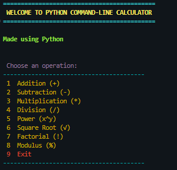
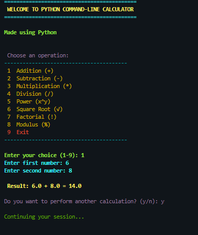
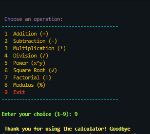
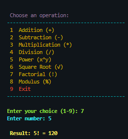
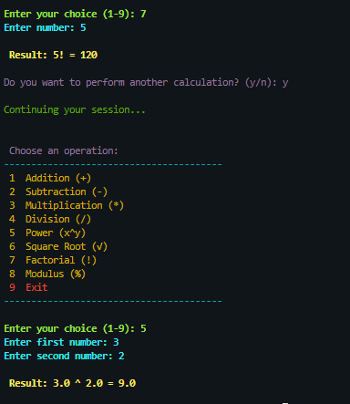
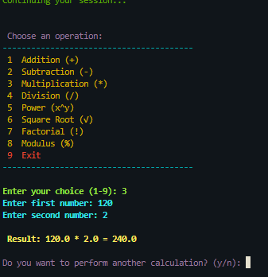

Python Command-Line Calculator

A colorful and interactive “Python Calculator built for learning and practical use.  
This calculator supports multiple arithmetic operations, runs continuously until the user decides to exit, and maintains the full calculation history during each session.
 ✨ Features
•	Addition, Subtraction, Multiplication, and Division  
•	Power, Modulus, Square Root, and Factorial calculations  
•	Handles invalid inputs and division by zero gracefully  
•	Keeps calculation history until you exit  
•	Clean, user-friendly interface with colored output  
•	Built using Python concepts like “functions”, “loops’, “conditional statements”, and  “error handling”.
 🧠 Concepts Covered
This project demonstrates:
•	Functions : for modular and reusable code  
•	Loops :  to continue operations until the user exits  
•	Conditional statements :  to handle different user inputs  
•	Exception handling :  to manage runtime errors safely  
•	User interaction :  using input and formatted print statements  
•	Color styling : via the `colorama` library for a better user experience

🚀 How to Run
1.	Clone this repository:
```bash
git clone https://github.com/Keerthana093/Python-CLI-Calculator.git
2.	Navigate to the project folder:
a.	cd Python-CLI-Calculator
3.	Install dependencies:
a.	pip install colorama
4.	Run the calculator:
a.	python calculator.py

📸 Screenshots









📂 Project Structure
Python-CLI-Calculator/
│
├── calculator.py        # Main calculator script
├── README.md            # Project documentation
├── LICENSE              # License file
├── ss1.png              # Screenshot 1
├── ss2.png              # Screenshot 2
├── ss3.png              # Screenshot 3
├── ss4.png              # Screenshot 4
├── ss5.png              # Screenshot 5
└── ss6.png              # Screenshot 6

🧾 License
This project is licensed under the MIT License.
You are free to use, modify, and distribute this project with proper attribution.
💡 Author
Keerthana S
Passionate about Python, learning by building projects, and exploring creative coding ideas.
